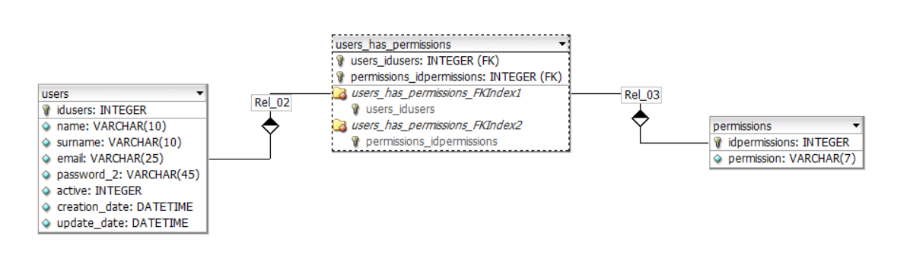

# crud-teste
projeto de crud básico usando springboot e angular

## Objetivo:
Criar um CRUD de usuários com as seguintes funcionalidades:
* Listar usuários
* Criar novo usuário
* Editar usuário
* Deletar usuário
  
## Tecnologia utilizada
* Backend:

  * Conhecimento em Java Spring Boot, Hibernate, Migrations e boas práticas.
    
* Frontend:

  * Recomendado usar Angular (versão 17 ou anterior) com biblioteca de componentes.

## Prazo
* 28/07/2025

## Modelagem relacional

